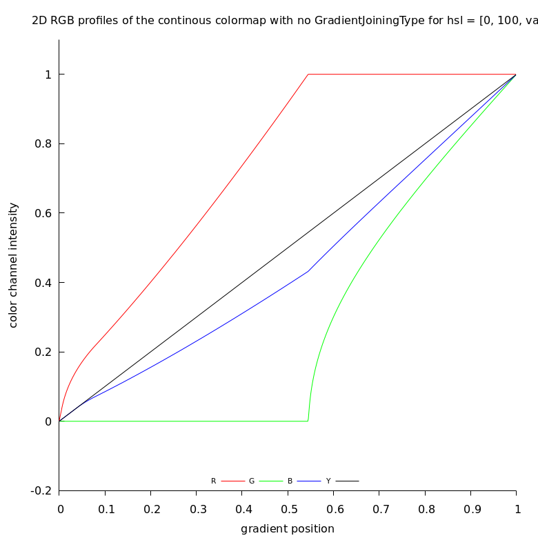
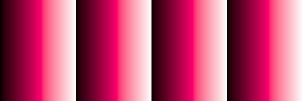
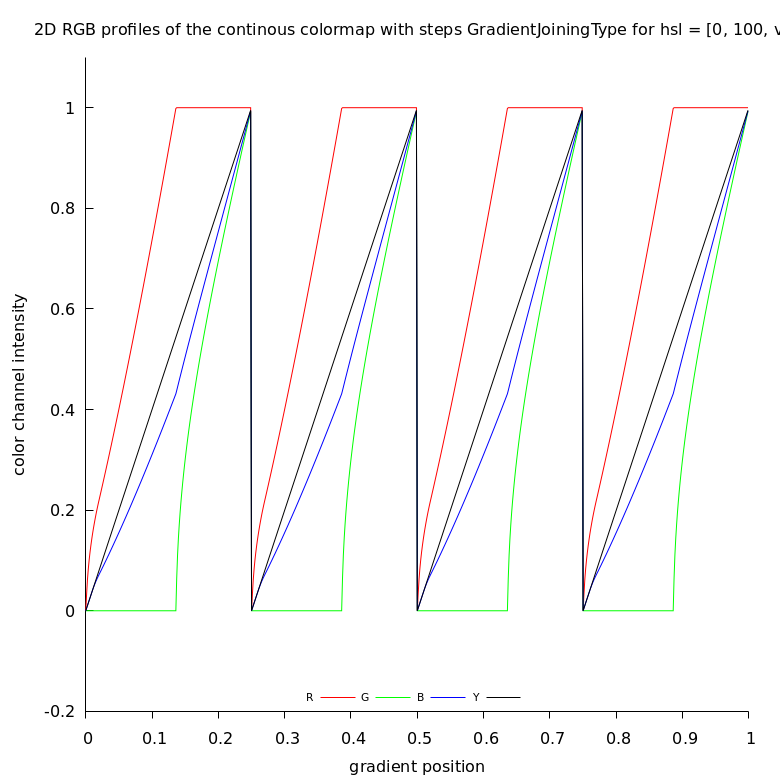
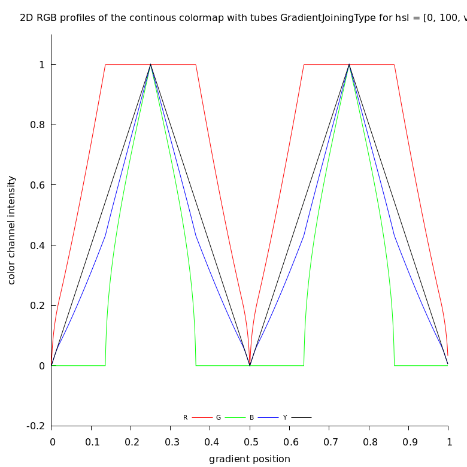
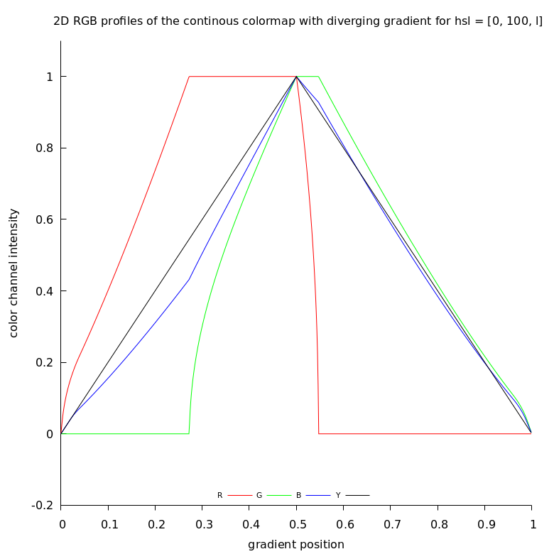
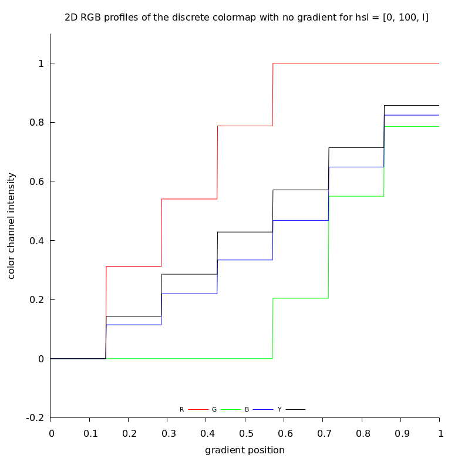
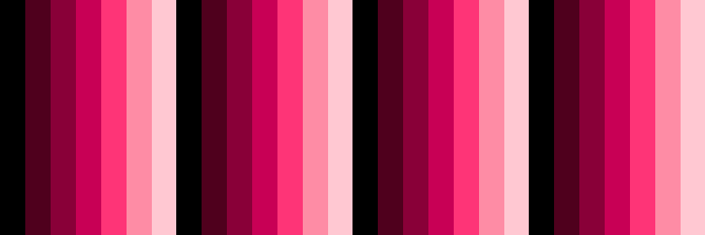
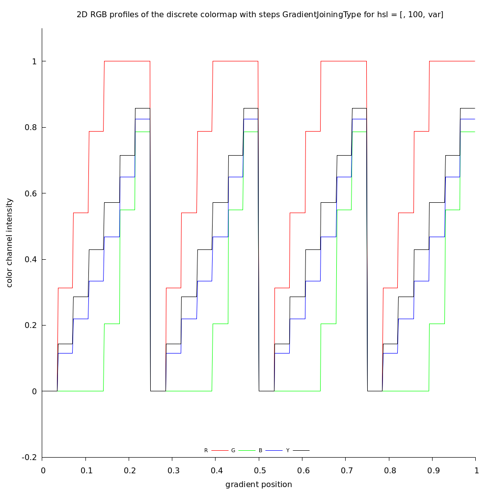
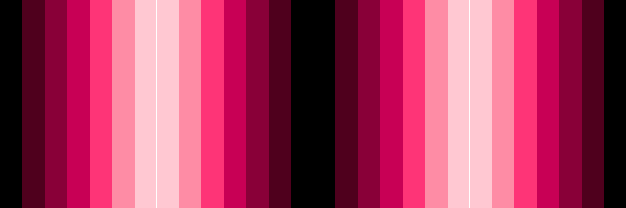
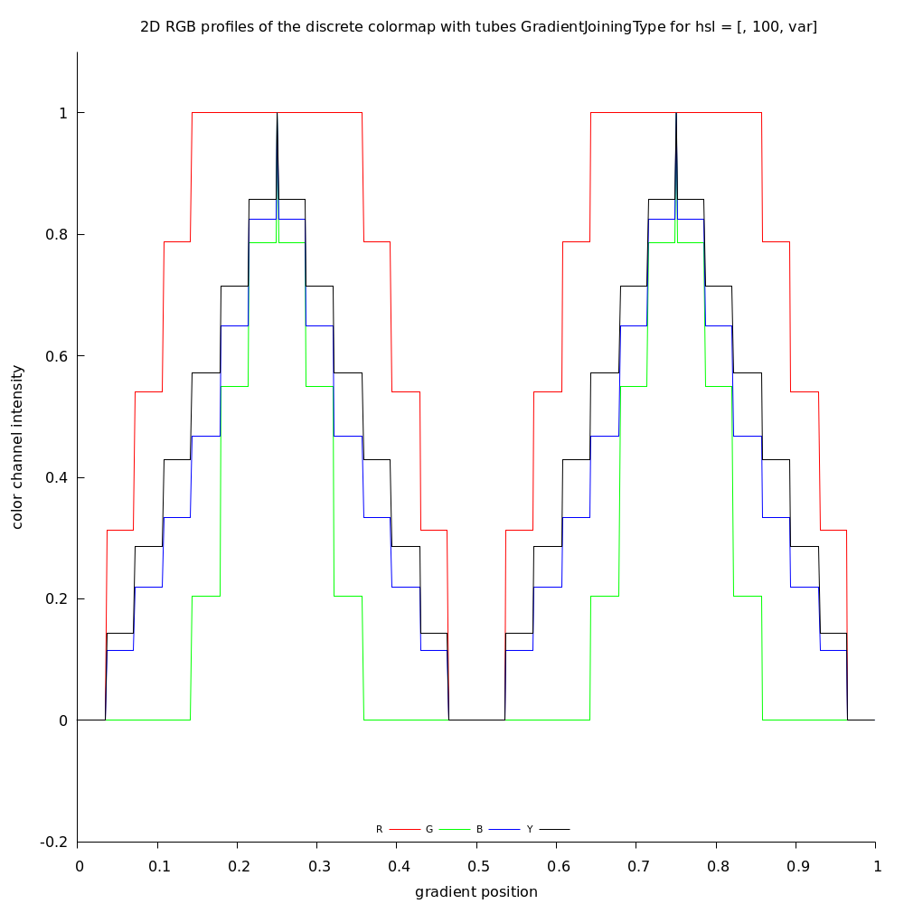

1D discrete and continous perceptually uniform ordered color gradients rendered in [HSL](https://www.hsluv.org/)   


# Examples

Gradient types:
* General types
  * continous  
  * discrete  
* Joining types 
  * no  
  * steps  
  * tubes  
  * diverging  

## HSL = [0, 100, l]


### continous
   

   


   

   


  

   


   

   


### discrete
   

   


   

   


  

   


   

   


# How to run the code ?

```
make
```
Text output: 

```bash
make
printf "make ppm and txt files "
make ppm and txt files gcc g.c  hsluv.c -lm -Wall
./a.out
 first color : hsl = [0, 100, l]
 complemntary color : hsl = [180, 100, l]
File 0_100_continous_no.txt saved. 
File 0_100_continous_no.ppm saved. 
 first color : hsl = [0, 100, l]
 complemntary color : hsl = [180, 100, l]
File 0_100_continous_steps.txt saved. 
File 0_100_continous_steps.ppm saved. 
 first color : hsl = [0, 100, l]
 complemntary color : hsl = [180, 100, l]
File 0_100_continous_tubes.txt saved. 
File 0_100_continous_tubes.ppm saved. 
 first color : hsl = [0, 100, l]
 complemntary color : hsl = [180, 100, l]
File 0_100_continous_diverging.txt saved. 
File 0_100_continous_diverging.ppm saved. 
 first color : hsl = [0, 100, l]
 complemntary color : hsl = [180, 100, l]
File 0_100_discrete_no.txt saved. 
File 0_100_discrete_no.ppm saved. 
 first color : hsl = [0, 100, l]
 complemntary color : hsl = [180, 100, l]
File 0_100_discrete_steps.txt saved. 
File 0_100_discrete_steps.ppm saved. 
 first color : hsl = [0, 100, l]
 complemntary color : hsl = [180, 100, l]
File 0_100_discrete_tubes.txt saved. 
File 0_100_discrete_tubes.ppm saved. 
 first color : hsl = [0, 100, l]
 complemntary color : hsl = [180, 100, l]
File 0_100_discrete_diverging.txt saved. 
File 0_100_discrete_diverging.ppm saved. 
 first color : hsl = [60, 100, l]
 complemntary color : hsl = [240, 100, l]
File 60_100_continous_no.txt saved. 
File 60_100_continous_no.ppm saved. 
 first color : hsl = [60, 100, l]
 complemntary color : hsl = [240, 100, l]
File 60_100_continous_steps.txt saved. 
File 60_100_continous_steps.ppm saved. 
 first color : hsl = [60, 100, l]
 complemntary color : hsl = [240, 100, l]
File 60_100_continous_tubes.txt saved. 
File 60_100_continous_tubes.ppm saved. 
 first color : hsl = [60, 100, l]
 complemntary color : hsl = [240, 100, l]
File 60_100_continous_diverging.txt saved. 
File 60_100_continous_diverging.ppm saved. 
 first color : hsl = [60, 100, l]
 complemntary color : hsl = [240, 100, l]
File 60_100_discrete_no.txt saved. 
File 60_100_discrete_no.ppm saved. 
 first color : hsl = [60, 100, l]
 complemntary color : hsl = [240, 100, l]
File 60_100_discrete_steps.txt saved. 
File 60_100_discrete_steps.ppm saved. 
 first color : hsl = [60, 100, l]
 complemntary color : hsl = [240, 100, l]
File 60_100_discrete_tubes.txt saved. 
File 60_100_discrete_tubes.ppm saved. 
 first color : hsl = [60, 100, l]
 complemntary color : hsl = [240, 100, l]
File 60_100_discrete_diverging.txt saved. 
File 60_100_discrete_diverging.ppm saved. 
 first color : hsl = [120, 100, l]
 complemntary color : hsl = [300, 100, l]
File 120_100_continous_no.txt saved. 
File 120_100_continous_no.ppm saved. 
 first color : hsl = [120, 100, l]
 complemntary color : hsl = [300, 100, l]
File 120_100_continous_steps.txt saved. 
File 120_100_continous_steps.ppm saved. 
 first color : hsl = [120, 100, l]
 complemntary color : hsl = [300, 100, l]
File 120_100_continous_tubes.txt saved. 
File 120_100_continous_tubes.ppm saved. 
 first color : hsl = [120, 100, l]
 complemntary color : hsl = [300, 100, l]
File 120_100_continous_diverging.txt saved. 
File 120_100_continous_diverging.ppm saved. 
 first color : hsl = [120, 100, l]
 complemntary color : hsl = [300, 100, l]
File 120_100_discrete_no.txt saved. 
File 120_100_discrete_no.ppm saved. 
 first color : hsl = [120, 100, l]
 complemntary color : hsl = [300, 100, l]
File 120_100_discrete_steps.txt saved. 
File 120_100_discrete_steps.ppm saved. 
 first color : hsl = [120, 100, l]
 complemntary color : hsl = [300, 100, l]
File 120_100_discrete_tubes.txt saved. 
File 120_100_discrete_tubes.ppm saved. 
 first color : hsl = [120, 100, l]
 complemntary color : hsl = [300, 100, l]
File 120_100_discrete_diverging.txt saved. 
File 120_100_discrete_diverging.ppm saved. 
 first color : hsl = [180, 100, l]
 complemntary color : hsl = [360, 100, l]
File 180_100_continous_no.txt saved. 
File 180_100_continous_no.ppm saved. 
 first color : hsl = [180, 100, l]
 complemntary color : hsl = [360, 100, l]
File 180_100_continous_steps.txt saved. 
File 180_100_continous_steps.ppm saved. 
 first color : hsl = [180, 100, l]
 complemntary color : hsl = [360, 100, l]
File 180_100_continous_tubes.txt saved. 
File 180_100_continous_tubes.ppm saved. 
 first color : hsl = [180, 100, l]
 complemntary color : hsl = [360, 100, l]
File 180_100_continous_diverging.txt saved. 
File 180_100_continous_diverging.ppm saved. 
 first color : hsl = [180, 100, l]
 complemntary color : hsl = [360, 100, l]
File 180_100_discrete_no.txt saved. 
File 180_100_discrete_no.ppm saved. 
 first color : hsl = [180, 100, l]
 complemntary color : hsl = [360, 100, l]
File 180_100_discrete_steps.txt saved. 
File 180_100_discrete_steps.ppm saved. 
 first color : hsl = [180, 100, l]
 complemntary color : hsl = [360, 100, l]
File 180_100_discrete_tubes.txt saved. 
File 180_100_discrete_tubes.ppm saved. 
 first color : hsl = [180, 100, l]
 complemntary color : hsl = [360, 100, l]
File 180_100_discrete_diverging.txt saved. 
File 180_100_discrete_diverging.ppm saved. 
 first color : hsl = [240, 100, l]
 complemntary color : hsl = [60, 100, l]
File 240_100_continous_no.txt saved. 
File 240_100_continous_no.ppm saved. 
 first color : hsl = [240, 100, l]
 complemntary color : hsl = [60, 100, l]
File 240_100_continous_steps.txt saved. 
File 240_100_continous_steps.ppm saved. 
 first color : hsl = [240, 100, l]
 complemntary color : hsl = [60, 100, l]
File 240_100_continous_tubes.txt saved. 
File 240_100_continous_tubes.ppm saved. 
 first color : hsl = [240, 100, l]
 complemntary color : hsl = [60, 100, l]
File 240_100_continous_diverging.txt saved. 
File 240_100_continous_diverging.ppm saved. 
 first color : hsl = [240, 100, l]
 complemntary color : hsl = [60, 100, l]
File 240_100_discrete_no.txt saved. 
File 240_100_discrete_no.ppm saved. 
 first color : hsl = [240, 100, l]
 complemntary color : hsl = [60, 100, l]
File 240_100_discrete_steps.txt saved. 
File 240_100_discrete_steps.ppm saved. 
 first color : hsl = [240, 100, l]
 complemntary color : hsl = [60, 100, l]
File 240_100_discrete_tubes.txt saved. 
File 240_100_discrete_tubes.ppm saved. 
 first color : hsl = [240, 100, l]
 complemntary color : hsl = [60, 100, l]
File 240_100_discrete_diverging.txt saved. 
File 240_100_discrete_diverging.ppm saved. 
 first color : hsl = [300, 100, l]
 complemntary color : hsl = [120, 100, l]
File 300_100_continous_no.txt saved. 
File 300_100_continous_no.ppm saved. 
 first color : hsl = [300, 100, l]
 complemntary color : hsl = [120, 100, l]
File 300_100_continous_steps.txt saved. 
File 300_100_continous_steps.ppm saved. 
 first color : hsl = [300, 100, l]
 complemntary color : hsl = [120, 100, l]
File 300_100_continous_tubes.txt saved. 
File 300_100_continous_tubes.ppm saved. 
 first color : hsl = [300, 100, l]
 complemntary color : hsl = [120, 100, l]
File 300_100_continous_diverging.txt saved. 
File 300_100_continous_diverging.ppm saved. 
 first color : hsl = [300, 100, l]
 complemntary color : hsl = [120, 100, l]
File 300_100_discrete_no.txt saved. 
File 300_100_discrete_no.ppm saved. 
 first color : hsl = [300, 100, l]
 complemntary color : hsl = [120, 100, l]
File 300_100_discrete_steps.txt saved. 
File 300_100_discrete_steps.ppm saved. 
 first color : hsl = [300, 100, l]
 complemntary color : hsl = [120, 100, l]
File 300_100_discrete_tubes.txt saved. 
File 300_100_discrete_tubes.ppm saved. 
 first color : hsl = [300, 100, l]
 complemntary color : hsl = [120, 100, l]
File 300_100_discrete_diverging.txt saved. 
File 300_100_discrete_diverging.ppm saved. 
 first color : hsl = [360, 100, l]
 complemntary color : hsl = [180, 100, l]
File 360_100_continous_no.txt saved. 
File 360_100_continous_no.ppm saved. 
 first color : hsl = [360, 100, l]
 complemntary color : hsl = [180, 100, l]
File 360_100_continous_steps.txt saved. 
File 360_100_continous_steps.ppm saved. 
 first color : hsl = [360, 100, l]
 complemntary color : hsl = [180, 100, l]
File 360_100_continous_tubes.txt saved. 
File 360_100_continous_tubes.ppm saved. 
 first color : hsl = [360, 100, l]
 complemntary color : hsl = [180, 100, l]
File 360_100_continous_diverging.txt saved. 
File 360_100_continous_diverging.ppm saved. 
 first color : hsl = [360, 100, l]
 complemntary color : hsl = [180, 100, l]
File 360_100_discrete_no.txt saved. 
File 360_100_discrete_no.ppm saved. 
 first color : hsl = [360, 100, l]
 complemntary color : hsl = [180, 100, l]
File 360_100_discrete_steps.txt saved. 
File 360_100_discrete_steps.ppm saved. 
 first color : hsl = [360, 100, l]
 complemntary color : hsl = [180, 100, l]
File 360_100_discrete_tubes.txt saved. 
File 360_100_discrete_tubes.ppm saved. 
 first color : hsl = [360, 100, l]
 complemntary color : hsl = [180, 100, l]
File 360_100_discrete_diverging.txt saved. 
File 360_100_discrete_diverging.ppm saved. 
 allways free memory (deallocate )  to avoid memory leaks 
 HSLuv-C: Human-friendly HSL. See www.hsluv.org 
h = Hue is in  [0.0, 360.0] range
s = Saturation is in  [0.0, 100.0] range
l = Lightness is in  [0.0, 100.0] range. Here it is variable  = gradient position 
printf "convert text files to png "
convert text files to png gnuplot plot.gp
printf "convert all ppm files to png using Image Magic convert "
convert all ppm files to png using Image Magic convert chmod +x g.sh
./g.sh
0_100_continous_diverging.ppm
0_100_continous_no.ppm
0_100_continous_steps.ppm
0_100_continous_tubes.ppm
0_100_discrete_diverging.ppm
0_100_discrete_no.ppm
0_100_discrete_steps.ppm
0_100_discrete_tubes.ppm
120_100_continous_diverging.ppm
120_100_continous_no.ppm
120_100_continous_steps.ppm
120_100_continous_tubes.ppm
120_100_discrete_diverging.ppm
120_100_discrete_no.ppm
120_100_discrete_steps.ppm
120_100_discrete_tubes.ppm
180_100_continous_diverging.ppm
180_100_continous_no.ppm
180_100_continous_steps.ppm
180_100_continous_tubes.ppm
180_100_discrete_diverging.ppm
180_100_discrete_no.ppm
180_100_discrete_steps.ppm
180_100_discrete_tubes.ppm
240_100_continous_diverging.ppm
240_100_continous_no.ppm
240_100_continous_steps.ppm
240_100_continous_tubes.ppm
240_100_discrete_diverging.ppm
240_100_discrete_no.ppm
240_100_discrete_steps.ppm
240_100_discrete_tubes.ppm
300_100_continous_diverging.ppm
300_100_continous_no.ppm
300_100_continous_steps.ppm
300_100_continous_tubes.ppm
300_100_discrete_diverging.ppm
300_100_discrete_no.ppm
300_100_discrete_steps.ppm
300_100_discrete_tubes.ppm
360_100_continous_diverging.ppm
360_100_continous_no.ppm
360_100_continous_steps.ppm
360_100_continous_tubes.ppm
360_100_discrete_diverging.ppm
360_100_discrete_no.ppm
360_100_discrete_steps.ppm
360_100_discrete_tubes.ppm
60_100_continous_diverging.ppm
60_100_continous_no.ppm
60_100_continous_steps.ppm
60_100_continous_tubes.ppm
60_100_discrete_diverging.ppm
60_100_discrete_no.ppm
60_100_discrete_steps.ppm
60_100_discrete_tubes.ppm
OK
printf "delete all ppm and txt files "
delete all ppm and txt files rm *.ppm
rm *.txt
```

# Theory

Sequential map with varying lightness, single hue rendered in HSLuv color space. See : [Interactive Creation of Perceptually Uniform Color Maps by  M. Lambers ](https://diglib.eg.org/bitstream/handle/10.2312/evs20201048/055-059.pdf)
* h is constant
* v is constant
* l is changing between 0.0 and 100.0 ( full range). It is variable  = gradient position 


```c
// for each gradient position ( = lightness) compute hsl
for(iX=0; iX<iXmax; ++iX){    
	position = (double) iX / iXmax;
	PrintRGBColorToTextFile(fp, position, modifiedPosition, rgb); // 
	SaveColorToArray(iX, rgb);
}

// convert hsl to rgb
hsluv2rgb(h, s, l, &r, &g, &b);
```


# How program works ?
General steps
* c program creates ppm and txt files
* Image Magic converts ppm to png ( color bars)
* gnuplot converts txt to png files ( 2D RGB color profiles ) 
* remove txt and ppm files

Steps of the C program:
* for each gradient type and h value create ppm and txt file
 * ppm file is created by saving 1D array of rgb values ( virtual 2D array)
 * txt file is a simple list of rgb values for gnuplot
  


Results: 
* there are 2 general gradient types ( continous and discrete ) 
* there are 4 gradient joining types ( no  steps  tubes  diverging)
* there are 7 values of lightnes :  0 60 120 180 240 300 360
* for each gradient there are 2 images: gradient bar and 2D RGB profile

so the program creates 2*4*7*2 = [112 png images](./images)


```c
// make gradient images for each gradient type 
void MakeGradientImages(const double h, const double s){

	GradientGeneralType gType;
  	GradientJoiningType jType;
  	
	//
  	for (gType = 0; gType< gMaxType; ++gType)
  		for (jType = 0; jType < jMaxType; ++jType)
  				MakeGradientTypeImages(gType, jType, h, s);
}

// from main : for each h make gradient  images 
	do {
   		MakeGradientImages(h,s);
   		h += h_step; // next gradient 
	} while( h < h_Max );
```


# Dependencies
* gcc
* hsluv-c: function hsluv2rgb from [HSLuv-C](https://github.com/hsluv/hsluv-c) = C implementation of [HSLuv = Human-friendly HSL](https://www.hsluv.org/)
* make
* gnuplot: onverts txt to png files ( 2D RGB color profiles ) 
* Image Magic: converts ppm to png ( color bars)
* bash


# Credits
* function hsluv2rgb from [HSLuv-C](https://github.com/hsluv/hsluv-c) = C implementation of [HSLuv = Human-friendly HSL](https://www.hsluv.org/)
* [1D-RGB-color-gradient](https://github.com/adammaj1/1D-RGB-color-gradient)

# Files


# Licence

[Licence](LICENCE)


# Git 


```git
echo "# hsluv-color-gradient" >> README.md
git init
git add README.md
git commit -m "first commit"
git branch -M main
git remote add origin git@github.com:adammaj1/hsluv-color-gradient.git
git push -u origin main
```


```
  git clone git@github.com:adammaj1/hsluv-color-gradient.git
```

Subdirectory

```git
mkdir images
git add *.png
git mv  *.png ./images
git commit -m "move"
git push -u origin main
```
then link the images:

```txt
 

```
to overwrite 
```git
git mv -f 
```


local repo: ~/hsluv-c/test/t2

